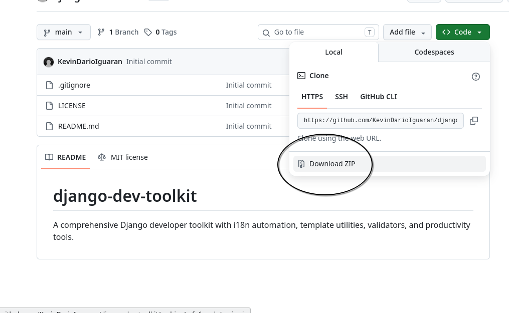
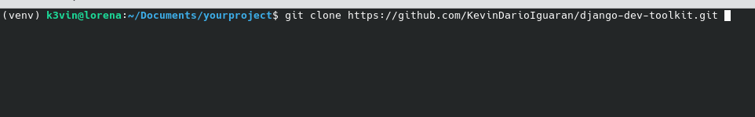

# Installation

Download as a zip file



After compressing the zip

or git clone the repo



Add to `INSTALLED_APPS`:

```python
INSTALLED_APPS = [
    # ...
    'django_dev_toolkit',
]
```

Run migrations:

```bash
python manage.py migrate
```
